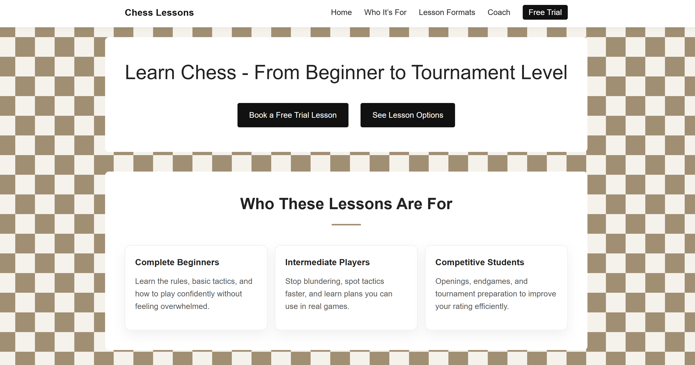
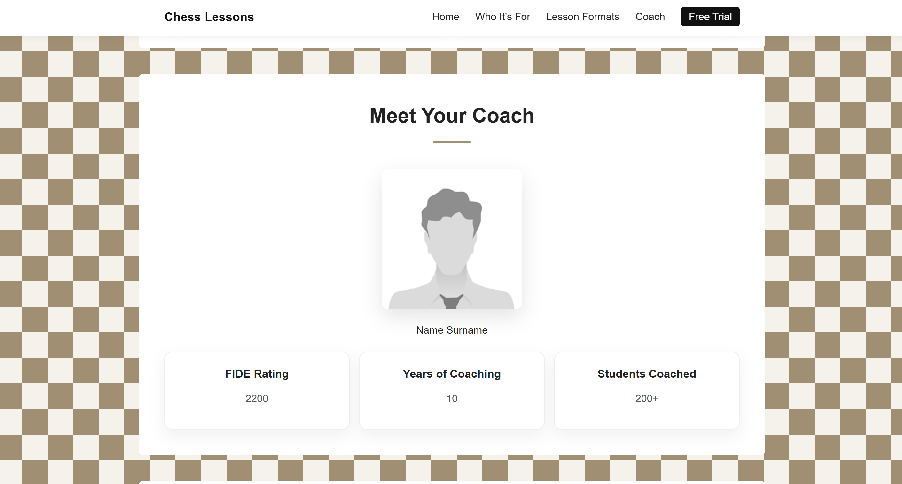
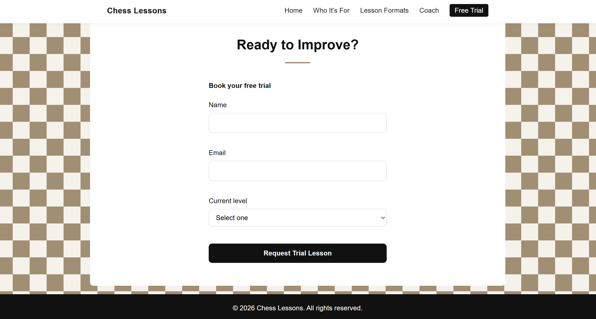

# ♟️ Chess Lessons Landing Page

## Overview

This project is a landing page for a chess coaching website.
It presents coaching services, lesson formats, instructor information, and a call-to-action for booking a free trial lesson. The design focuses on structured content and a chess-themed visual style.

---

## Demo

The site can be accesed [here](https://augustin-ploteanu.github.io/landing-page-labs).

---

## Sections Included

* Hero Section
* Who These Lessons Are For
* How It Works
* Lesson Formats
* Meet Your Coach
* Call To Action (Trial Booking)

---

## Design Features

* Checkerboard background applied to the main content area
* Rounded card components with hover lift effect
* Centered section titles with decorative accent underline
* Call-to-action section with form

---

## Screenshots

